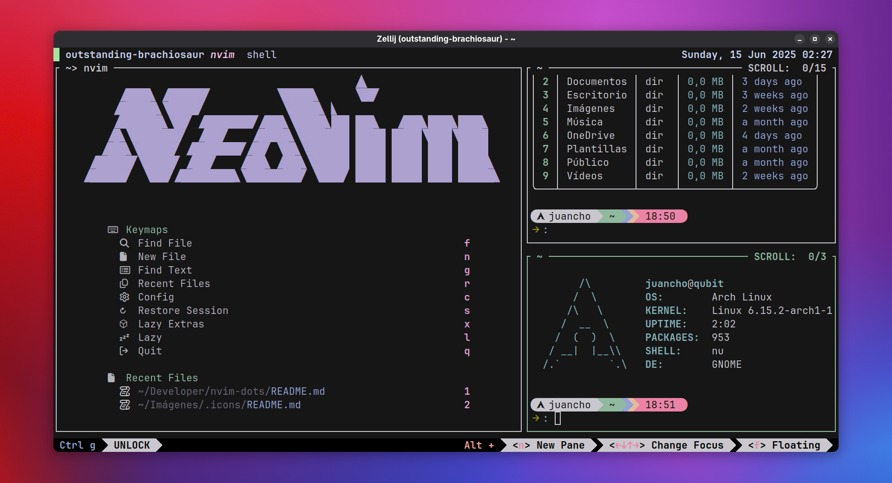

<div align="center">
  <h1>Neovim + Nix 🚀</h1>
</div>



## 1. Install nix (MacOS - WSL2 - Linux)

```bash
sh <(curl -L https://nixos.org/nix/install)
```

## 2. Configure Nix to use experimental features

```bash
echo "extra-experimental-features = flakes nix-command" | sudo tee -a /etc/nix/nix.conf
echo "build-users-group = nixbld" | sudo tee -a /etc/nix/nix.conf
```

## 3. Clone the repository

```bash
git clone https://github.com/juanchopi37/nvim.dots.git --depth=1
```

```bash
cd nvim.dots
```

## 4. Change the Nix Flake File

```bash
vim flake.nix
```

Depending on your operating system, change this on lines **17** and **20** in the `system` variables.

- "aarch64-darwin"
  Architecture: Apple Silicon (M1, M2, M3, etc.).
  Operating System: macOS.

- "x86_64-darwin"
  Architecture: Intel (older Macs).
  Operating System: macOS.

- "x86_64-linux"
  Architecture: 64-bit Intel/AMD.
  Operating System: Linux.

- "aarch64-linux"
  Architecture: 64-bit ARM (e.g., Raspberry Pi 4, ARM servers).
  Operating System: Linux.

- "i686-linux"
  Architecture: 32-bit Intel/AMD (obsolete).
  Operating System: Linux.

- "riscv64-linux"
  Architecture: 64-bit RISC-V.
  Operating System: Linux (experimental).

- "x86_64-freebsd"
  Architecture: 64-bit Intel/AMD.
  Operating System: FreeBSD.

Change the line `home.username = "YourUser"`; to reflect your machine's username.

Modify `home.homeDirectory` accordingly:

    On macOS: /Users/YourUser
    On Linux: /home/YourUser

## Run the installation command

```bash
nix run github:nix-community/home-manager -- switch --flake .#juancho -b backup
```

## Fix Clipboard issues in Arch Linux

In Arch Linux you may not have the clipboard if you use X11 to solve this you must install the clipboard

code

```bash
sudo pacman -S xclip
```

## Shells Suported

- Fish
- Zsh
- Nushell

## Terminal Suported

- Ghostty
- Alacritty
- Wezterm
